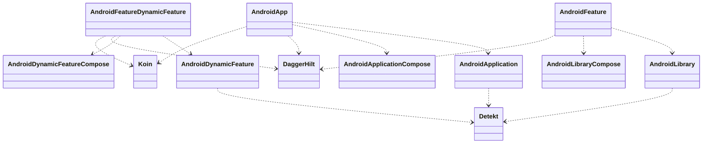
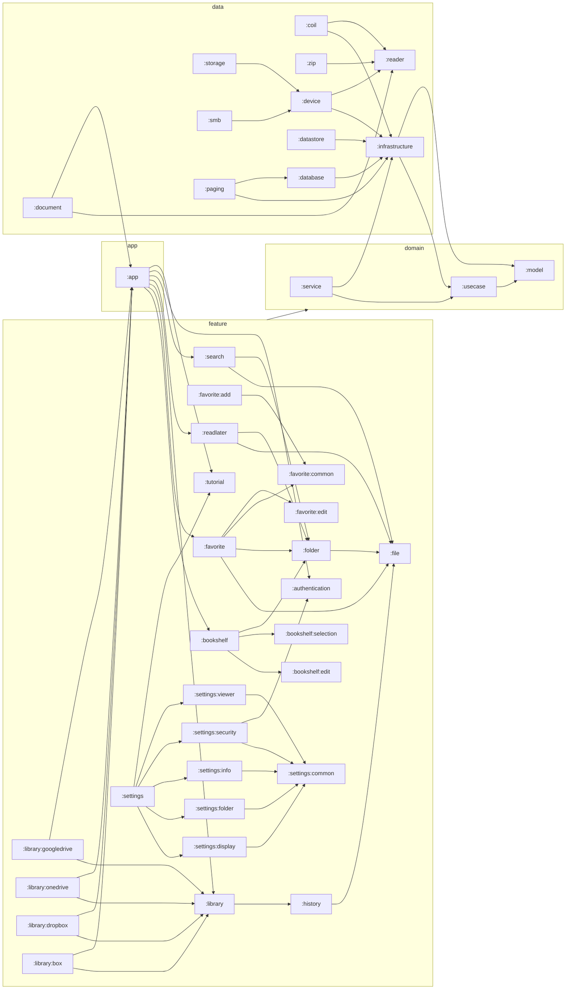

# ComicViewer

## Coding rules

Follow Android's [Kotlin style guide](https://developer.android.com/kotlin/style-guide).
Also, use [trailing comma](https://kotlinlang.org/docs/coding-conventions.html#trailing-commas).

Use [detekt](https://github.com/detekt/detekt) as a static code analysis tool.

## Plugin configuration

## Module configuration

    :app  # Application
    :data:database         # Room Database
    :data:datastore        # DataStore
    :data:infrastructure   # Infrastructure
    :data:reader           # ファイル読み込みのインターフェース
    :data:reader:document  # pdf, epub, cbz, cbr .etc の実装
    :data:reader:zip       # zip, rar, 7z .etc の実装
    :data:service          # WorkManagerの実装
    :data:storage          # 様々なプロトコルの抽象クラス
    :data:storage:device   # Androidのストレージの実装クラス
    :data:storage:smb      # SMBの実装クラス
    :di                    # Daggerの依存関係解決用のモジュール
                             appモジュールからdataへ直接的に依存させないため
    :domain:model          # ドメインモデル
    :domain:service        # ドメインサービス
    :domain:usecase        # ユースケース
    :feature:authentication  # 認証機能
    :feature:book          # 読書機能
    :feature:bookshelf     # 本棚機能
    :feature:bookshelf:edit  # 本棚編集機能
    :feature:bookshelf:selection  # 登録可能本棚リスト機能
    :feature:favorite      # お気に入り機能
    :feature:favorite:add  # お気に入り追加機能
    :feature:favorite:common  # お気に入り共通機能
    :feature:favorite:create  # お気に入り作成機能
    :feature:favorite:edit  # お気に入り編集機能
    :feature:file          # ファイルリスト
    :feature:folder        # フォルダ画面
    :feature:history       # 閲覧履歴機能
    :feature:library       # ライブラリ機能
    :feature:library:box   # Boxライブラリ機能
    :feature:library:dropbox  # Dropboxライブラリ機能
    :feature:library:googledrive  # GoogleDriveライブラリ機能
    :feature:library:onedrive  # OneDriveライブラリ機能
    :feature:readlater     # 後で読む機能
    :feature:search        # 検索機能
    :feature:settings      # 設定機能
    :feature:settings:common  # 設定共通機能
    :feature:settings:display  # 表示設定機能
    :feature:settings:folder  # フォルダ設定機能
    :feature:settings:info  # 情報設定機能
    :feature:settings:security  # セキュリティ設定機能
    :feature:settings:viewer  # ビューア設定機能
    :feature:tutorial      # チュートリアル機能
    :feature:framework:common  # 共通機能
    :feature:framework:designsystem  # デザインシステム
    :feature:framework:notificaiton  # 通知機能
    :feature:framework:ui  # UI機能

## Module dependencies

## Screen transition diagram

